Implemented Market Basket Analysis using Spark and Scala on the Instacart data, and used FP-Growth algorithm to find patterns in cart and provide recommendations based on items in cart. 

The most famous story about association rule mining is the “beer and diaper”. Researchers discovered that customers who buy diapers also tend to buy beer. This classic example shows that there might be many interesting association rules hidden in our daily data.
Association rule mining is a technique to identify underlying relations between different items. There are many methods to perform association rule mining.

Apriori[1] is an algorithm for frequent item set mining and association rule learning over relational databases. It proceeds by identifying the frequent individual items in the database and extending them to larger and larger item sets as long as those item sets appear sufficiently often in the database. The frequent item sets determined by Apriori can be used to determine association rules which highlight general trends in the database: this has applications in domains such as market basket analysis.

The main idea of Apriori is
All non-empty subsets of a frequent itemset must also be frequent.

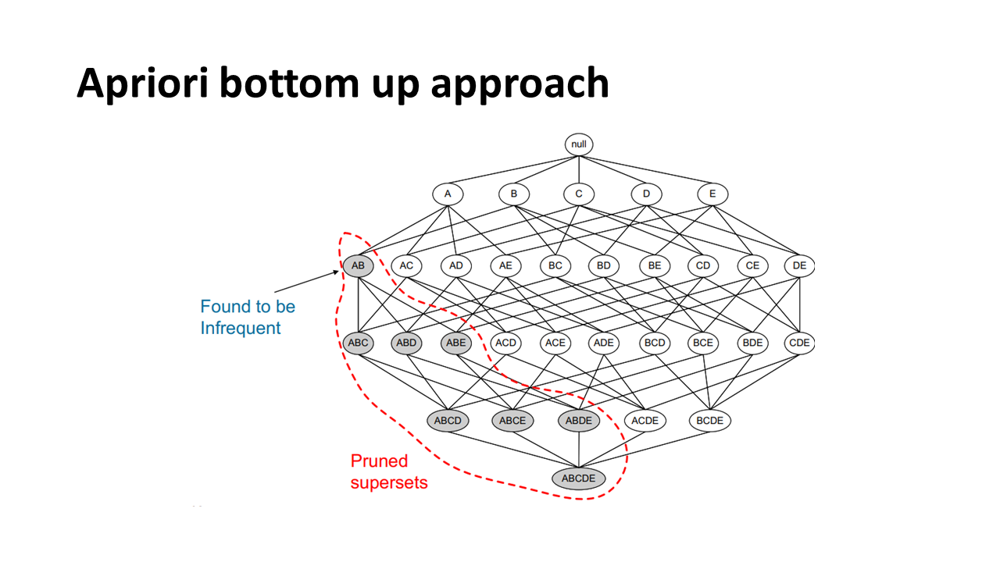

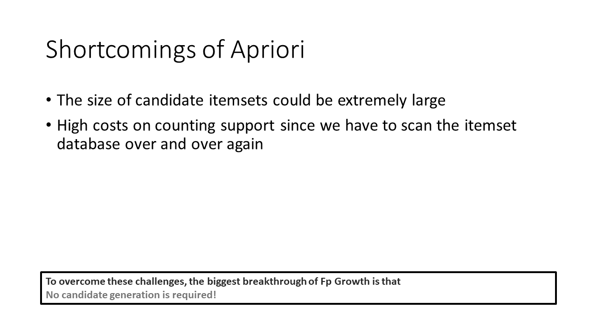

All the problems of Apriori can be solved by leveraging the FP tree. To be more specific, the itemset size will not be a problem anymore since all the data will be stored in a way more compact version. Moreover, there’s no need to scan the database over and over again. Instead, traversing the FP tree could do the same job more efficiently.

## Introduction to FP-Growth

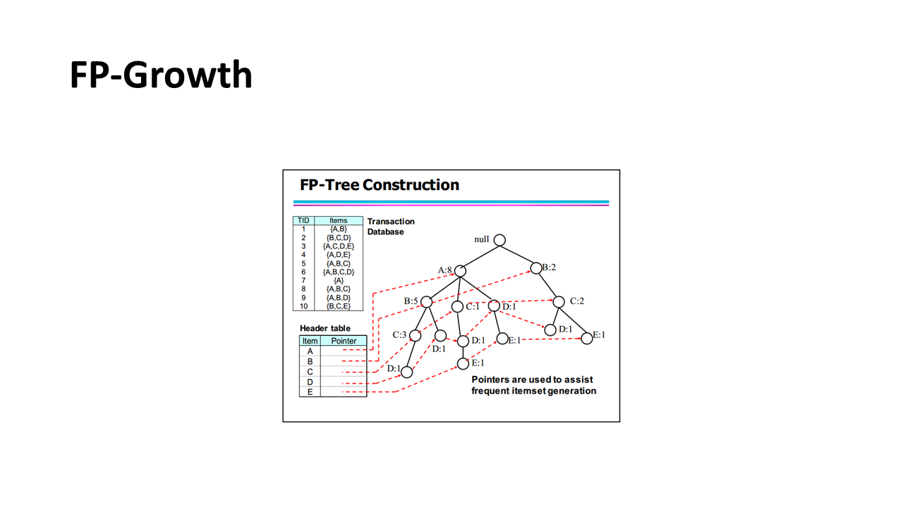

FP-growth is an improved version of the Apriori Algorithm which is widely used for frequent pattern mining(AKA Association Rule Mining). It is used as an analytical process that finds frequent patterns or associations from data sets. For example, grocery store transaction data might have a frequent pattern that people usually buy chips and beer together. The Apriori Algorithm produces frequent patterns by generating itemsets and discovering the most frequent itemset over a threshold “minimal support count”. It greatly reduces the size of the itemset in the database by one simple principle:
If an itemset is frequent, then all of its subsets must also be frequent.
However, the Apriori Algorithm has a major shortfall. Using Apriori required multiple scans of the database to check the support count of each item and itemsets. When the database is huge, this will cost a significant amount of disk I/O and computing power. Therefore the FP-Growth algorithm is created to overcome this shortfall. It only scans the database twice and used a tree structure(FP-tree) to store all the information. The root represents null, each node represents an item, while the association of the nodes is the itemsets with the order maintained while forming the tree. The FP-tree is concise and is used to directly generating large itemsets. Once an FP-tree has been constructed, it uses a recursive divide-and-conquer approach to mine the frequent itemsets.

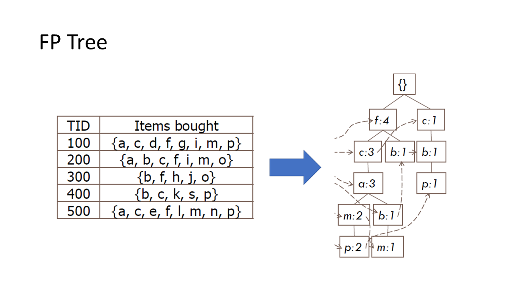

FP tree is the core concept of the whole FP Growth algorithm. Briefly speaking, the FP tree is the compressed representation of the itemset database. The tree structure not only reserves the itemset in DB but also keeps track of the association between itemsets
The tree is constructed by taking each itemset and mapping it to a path in the tree one at a time. The whole idea behind this construction is that
More frequently occurring items will have better chances of sharing items
We then mine the tree recursively to get the frequent pattern. Pattern growth, the name of the algorithm, is achieved by concatenating the frequent pattern generated from the conditional FP trees.

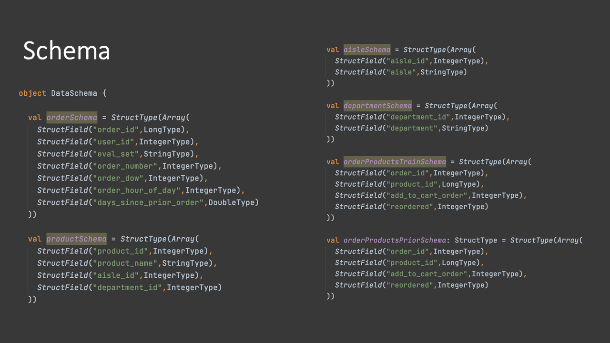
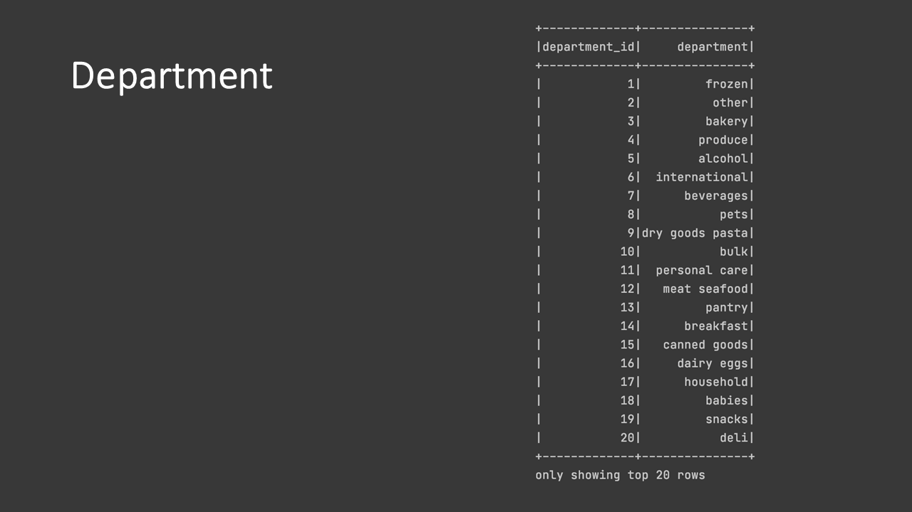
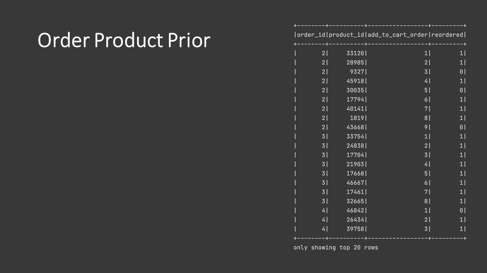
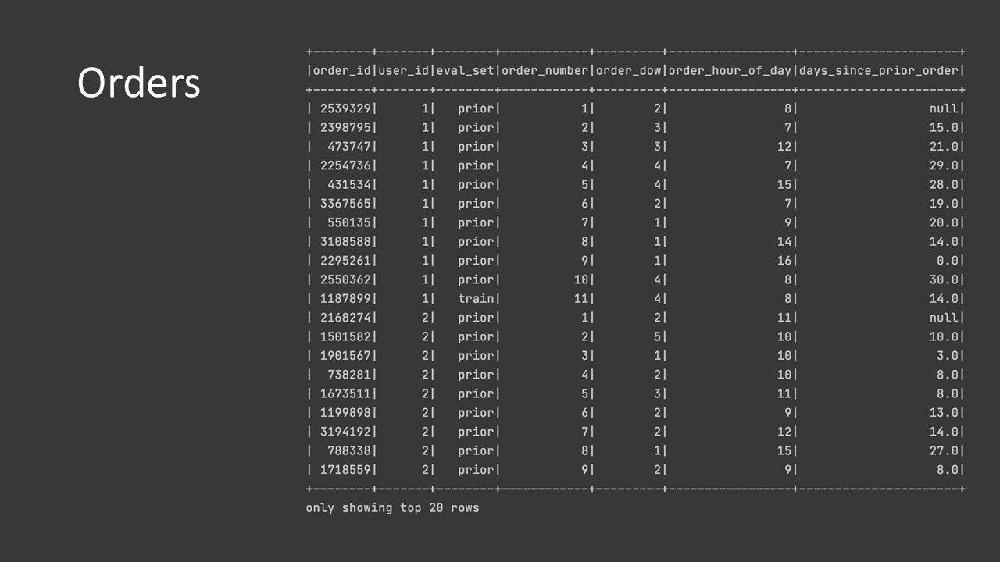
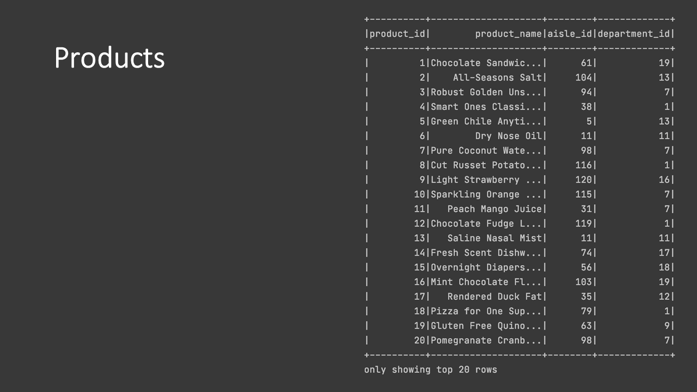
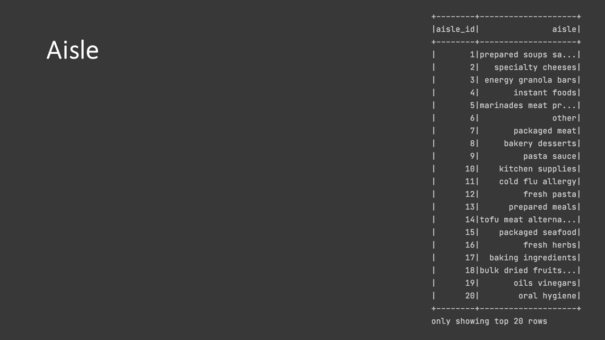
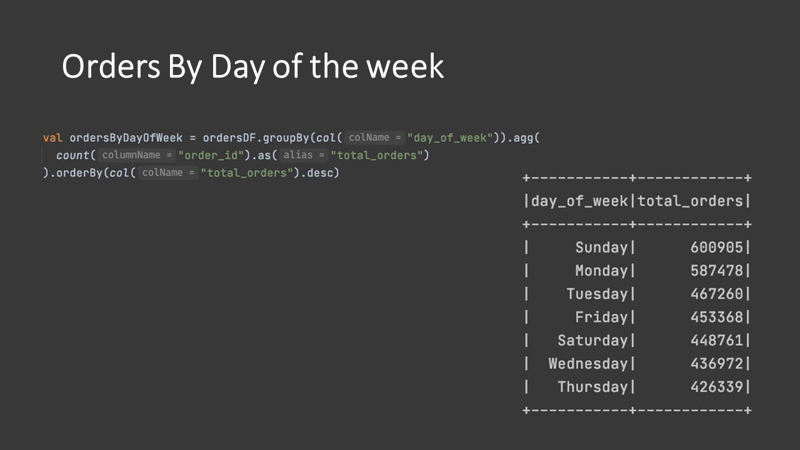

